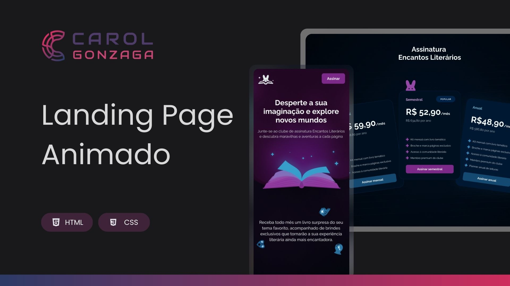

  

 

Um projeto que apresenta uma Landing Page responsiva para um clube de assinaturas, com design moderno, interações sutis e uma experiência de usuário envolvente.

  <a href="#-tecnologias">Tecnologia</a>&nbsp;&nbsp;&nbsp;|&nbsp;&nbsp;&nbsp;<a href="https://carolgonzaga.github.io/lp-clube-de-assinaturas/">Acesse o Projeto</a>

 
 

  

 
 

## 🚀 Tecnologias

Esse projeto foi desenvolvido com as seguintes tecnologias:

- HTML5
- CSS3

 
 

## 🎯 Objetivo

O desafio prático consiste em criar uma Landing Page para um clube de assinaturas, simulando um ambiente de adesão e benefícios. O objetivo foi aplicar conceitos de design responsivo, animações e interatividade, proporcionando uma navegação intuitiva e uma experiência visual interativa.
